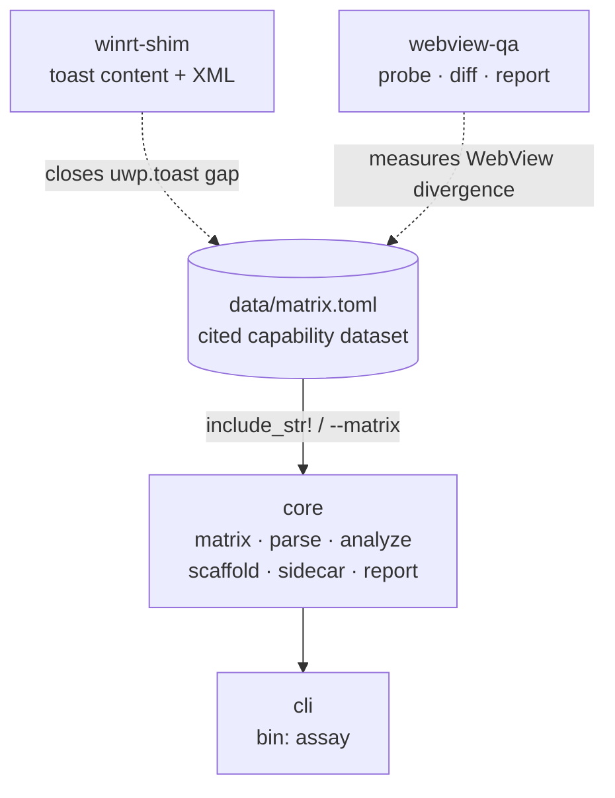
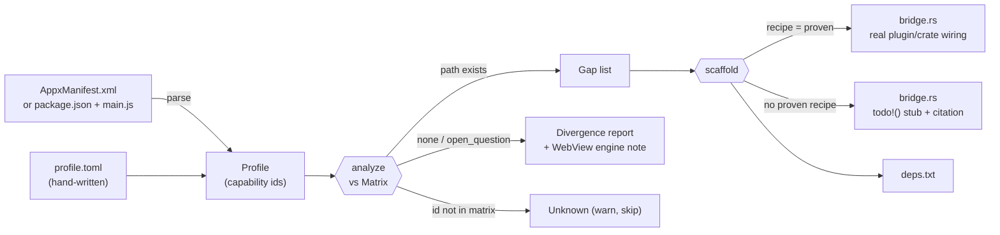
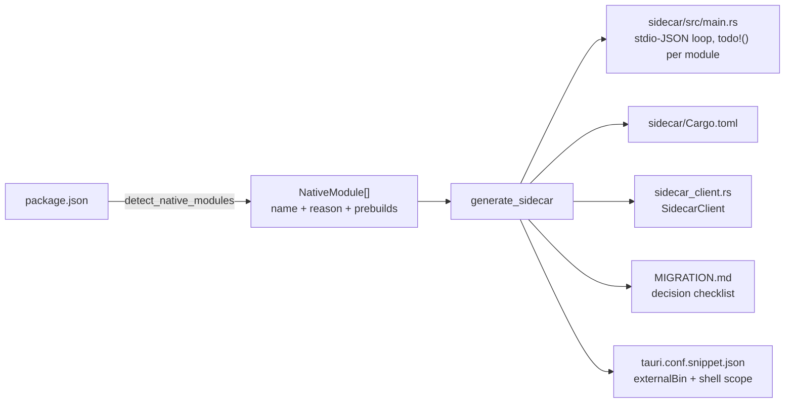

# Assay Architecture
<!-- rev:001 (RFC 3339) 2026-07-23T00:00:00Z -->

Four crates in one cargo workspace. `core` holds all logic and is data-driven off
`data/matrix.toml`; `cli` is a thin shell; `winrt-shim` and `webview-qa` are independent
tools that close specific gaps the matrix identifies.

## Crate graph



## The main flow (`analyze` / `scaffold`)



**The honesty boundary is the `analyze` split:** only capabilities that reach the *gap list*
can ever reach the scaffolder. `none` and `open_question` rows are routed to the divergence
report and never produce code.

## Sidecar kit flow (`sidecar`)



## Cross-WebView harness flow

```mermaid
flowchart LR
    CFG["webview-qa.toml<br/>features + selectors"] -->|render_probe| JS["probe JS (per engine)"]
    JS -.->|driver evals in page<br/>(host-gated, not yet built)| B1["EngineBlob (webview2)"]
    JS -.-> B2["EngineBlob (wkwebview)"]
    B1 --> DIFF{{"diff (pairwise)"}}
    B2 --> DIFF
    DIFF --> R["Divergence report<br/>HIGH feature · MEDIUM style/console · INFO ua"]
```

The dashed edges are the **only** unbuilt part: live engine drivers. Everything downstream of
a recorded blob works today, which is why `webview-qa diff` operates on blob files.

## Key invariants in code

| Invariant | Enforced by |
|---|---|
| Every matrix row cites a public doc | `core::matrix` test `every_row_has_a_citation` |
| Generated bridge is valid Rust | `core::scaffold` test via `syn::parse_file` |
| Generated sidecar is valid Rust | `core::sidecar` test via `syn::parse_file` |
| Generator output doesn't drift | `insta` golden snapshots (bridge, sidecar, report) |
| A 1-engine run isn't cross-engine | `webview_qa::render_report` engines-exercised line |
